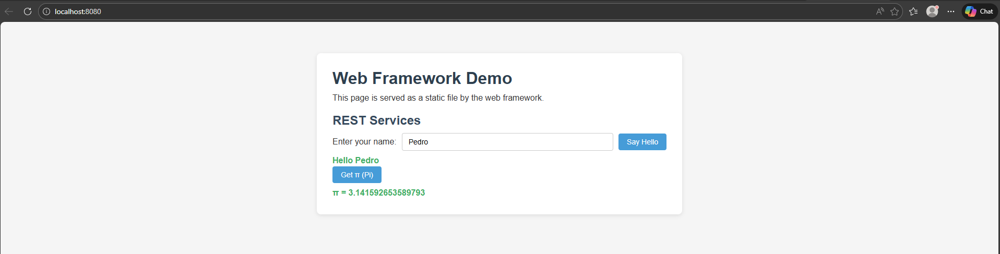
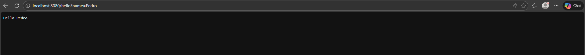
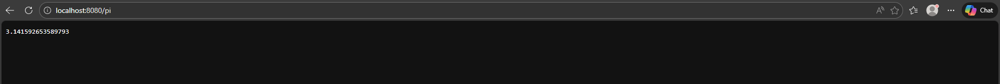
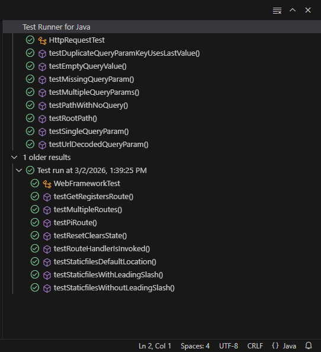

# Web Framework

This project upgrades a basic web server into a lightweight framework for building RESTful services and managing static files. It allows developers to define routes with lambda expressions, extract query parameters easily, and configure static file locations. Built with Maven and Git, the framework demonstrates core concepts of HTTP, web architecture, and scalable application development.

## Overview

This project provides a minimal HTTP/1.1 server and a small framework-style API to:

- Register GET endpoints using lambdas
- Parse query parameters through a request wrapper
- Serve static assets (HTML/CSS/JS) from the classpath (`src/main/resources`)
- Keep the runtime lightweight (raw sockets + thread pool)

## Key Features

- Lambda-based routing via a functional `Route` interface
- Query string parsing with `HttpRequest.getValues(name)`
- Static file serving from `resources/webroot`
- No external runtime dependencies
- Unit tests validating request parsing and framework behavior

## Architecture

### Key Components

| Class | Responsibility |
|---|---|
| `WebFramework` | Entry point – exposes `get()`, `staticfiles()`, `start()` |
| `WebServer` | Accepts TCP connections, parses HTTP/1.1 requests, dispatches to routes or static files |
| `HttpRequest` | Parses query string; exposes `getValues(name)` |
| `HttpResponse` | Chainable builder for status code and content-type |
| `Route` | `@FunctionalInterface` — `(HttpRequest, HttpResponse) -> String` |

### Request Lifecycle (High-Level)

1. `WebServer` accepts a socket connection
2. Parses request line + headers
3. Resolves the request to:
   - a registered **route** (`WebFramework.get(...)`), or
   - a **static file** under the configured `staticfiles(...)` location
4. Builds and writes the HTTP response


## Results / Output Examples

### 1) Static file served (`/index.html`)



### 2) REST route with query param (`/hello?name=Pedro`)



### 3) Numeric REST route (`/pi`)



### 4) Static assets loading (CSS/JS)

### 4) Test execution (`mvn test`)



**Description:** Maven test summary showing all unit tests passing.


## Getting Started

### Prerequisites

- Java 21+
- Apache Maven 3.6+

### Installation

```bash
# Clone the repository
git clone https://github.com/mayerllyyo/Microframeworks-WEB
cd Microframeworks-WEB

# Build
mvn clean package
```

## Usage

### Registering Routes

```java
import edu.eci.arep.WebFramework;

public class MyApp {
    public static void main(String[] args) throws Exception {
        // Register GET REST routes using lambdas
        WebFramework.get("/hello", (req, resp) -> "Hello " + req.getValues("name"));
        WebFramework.get("/pi", (req, resp) -> String.valueOf(Math.PI));

        // Start the server (blocks)
        WebFramework.start();
    }
}
```

### Serving Static Files

```java
// Specify where static files live (classpath-relative)
WebFramework.staticfiles("/webroot");
```

### API Reference

#### `WebFramework.get(String path, Route handler)`

Registers a GET route. The handler lambda receives an `HttpRequest` and `HttpResponse` and returns the response body as a `String`.

#### `WebFramework.staticfiles(String location)`

Sets the classpath folder from which static files are served (e.g., "webroot" or "/webroot/public"). Defaults to "webroot".

#### `WebFramework.start()`

Starts the HTTP server on port 8080 (default). Blocks until the process is stopped.

#### `HttpRequest.getValues(String name)`

Returns the value of the named query parameter, or `""` if absent.


## Example Requests

After starting the server:

| Request | Response |
|---|---|
| `GET http://localhost:8080/index.html` | Serves `webroot/index.html` |
| `GET http://localhost:8080/hello?name=Pedro` | `Hello Pedro` |
| `GET http://localhost:8080/pi` | `3.141592653589793` |
| `GET http://localhost:8080/styles/app.css` | Serves the CSS file |


## Running Tests

```bash
mvn test
```

### What is covered?

**`HttpRequestTest`** verifies query-parameter parsing:
- Path with no query string
- Single and multiple query parameters
- Missing parameter returns `""`
- URL-decoded values (`%20` → space)
- Empty query value
- Root path `/`

**`WebFrameworkTest`** verifies framework behaviour:
- `get()` registers routes correctly
- Route handler is invoked with correct request/response
- `/pi` route returns `Math.PI`
- Default and custom `staticfiles()` location
- Multiple routes coexist
- `reset()` clears all state (used between tests)


## Author

- **Mayerlly Suárez Correa** [mayerllyyo](https://github.com/mayerllyyo)

## License

This project is licensed under the MIT License - see the [LICENSE](LICENSE) file for details
